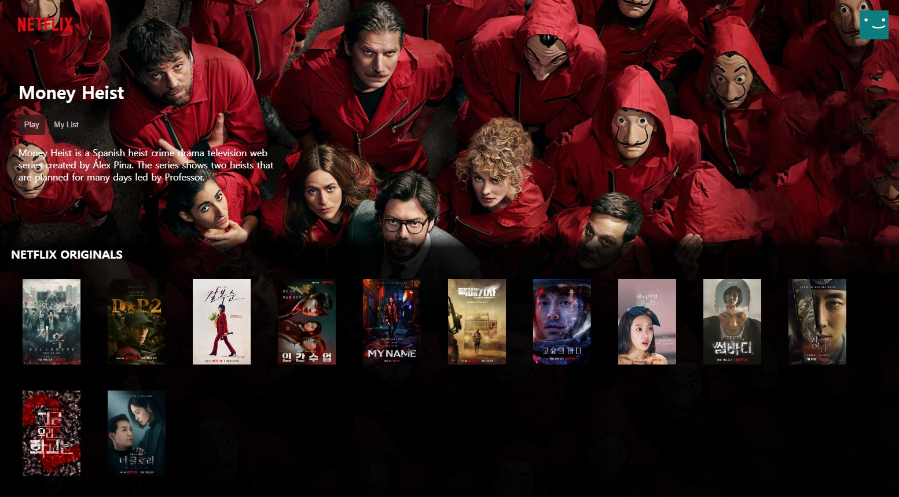
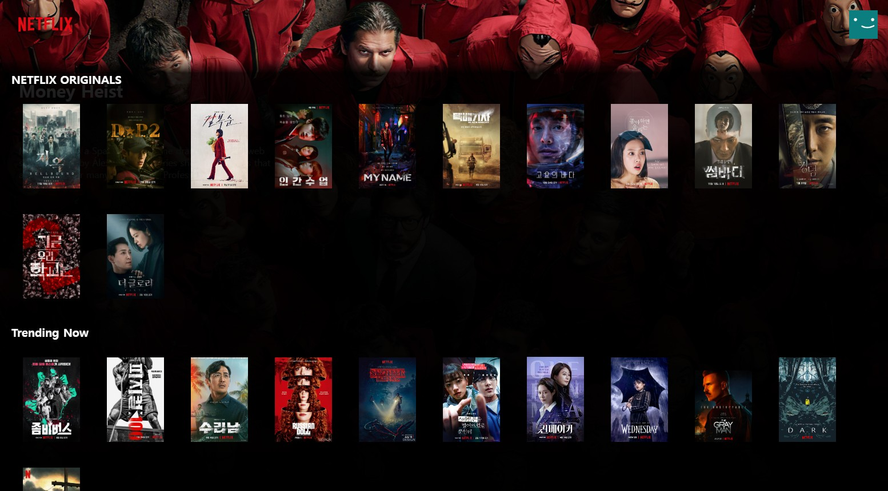
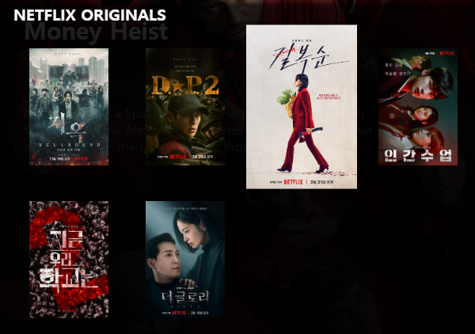

<h2>개인 프로젝트 : 넷플릭스 화면 디자인</h2>
<summary><h2>사용 스택</h2></summary> 
<div>

	
</div>

<details open>
<summary><h2>📂 파일 구조</h2></summary>
<div markdown="1">


```
🗂️project
├─📂assets - 사용할 이미지들
│  └─🖼️images
│ 
├─📂styles - 적용한 스타일
│  └─🖌️bottom.css
│  └─🖌️general.css
│  └─🖌️header.css
│ 
└─🗒️index.html
```

</div>
</details>

<summary><h2>최종 결과</h2></summary>




<h3>주요 기능</h3>

<summary> transition & transform 사용하여 이미지에 마우스 호버 시 점차 확대 </summary>
 
```  
 .main-bottom img {
    transition: transform 1s ease-out;
}

.main-bottom img:hover {
    transform: scale(1.4);
```

<summary> linear-gradient를 주어 검정색 opacity를 조절하여 배경과 작품 목록 컨테이너 사이의 경계를 부드럽게 표시 </summary>
 
```  
background: linear-gradient(rgba(0, 0, 0, 0) 1%,
            rgba(0, 0, 0, 0.85) 4%,
            rgba(0, 0, 0, 0.95) 20%,
            rgba(0, 0, 0, 1) 100%);
```


